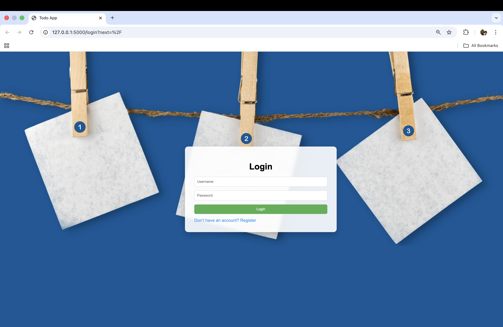
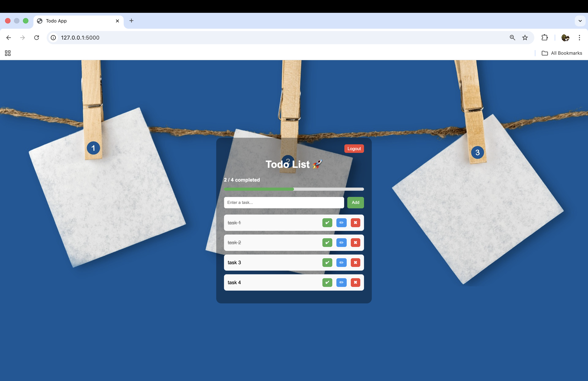
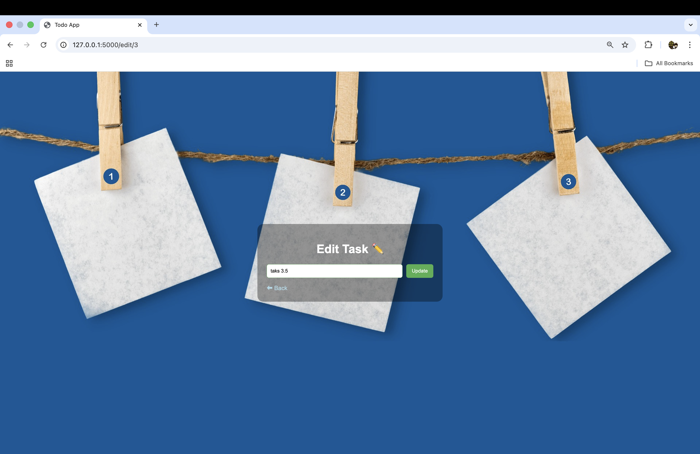

# 📝 Flask Todo App

A clean and modern Todo List web application built with Flask, featuring authentication, task management, and session security.

---

## 🚀 Features

* 🔐 User Registration & Login
* ✅ Add, Edit, Delete Tasks
* ✔ Mark Tasks as Complete
* 📊 Progress Tracking
* ⏱ Session Timeout (auto logout on inactivity)
* 🚫 Cache prevention after logout (no back-button access)
* 🎨 Clean UI with background and layered design

---

## 🛠 Tech Stack

* **Backend:** Python (Flask)
* **Database:** SQLite
* **Frontend:** HTML, CSS
* **Authentication:** Flask-Login
* **ORM:** SQLAlchemy

---

## 📸 Screenshots

### 🏠 Todo Dashboard






## ⚙️ Installation

### 1. Clone the repository

```bash
git clone https://github.com/YOUR_USERNAME/todo-app-flask.git
cd todo-app-flask
```

### 2. Create virtual environment

```bash
python -m venv venv
```

### 3. Activate environment

**Mac/Linux**

```bash
source venv/bin/activate
```

**Windows**

```bash
venv\Scripts\activate
```

### 4. Install dependencies

```bash
pip install -r requirements.txt
```

### 5. Run the app

```bash
python app.py
```

---

## 🔒 Security Features

* Session expires after inactivity
* Protected routes using `@login_required`
* Cache disabled to prevent back-button access after logout

---

## 📌 Notes

* Uses SQLite database (`tasks.db`)
* Designed as a beginner-to-intermediate Flask project
* Focused on clean UI + practical security improvements

---

## 👨‍💻 Author

**Your Name**

---

## ⭐ If you like this project

Give it a star ⭐ on GitHub — it helps a lot!
